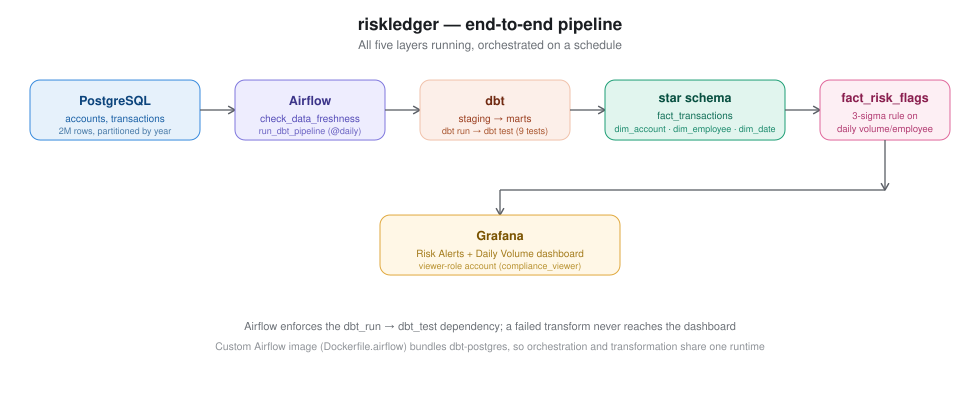
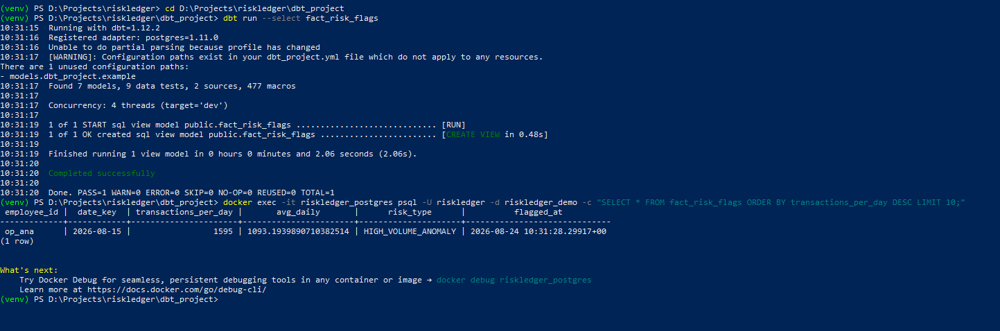
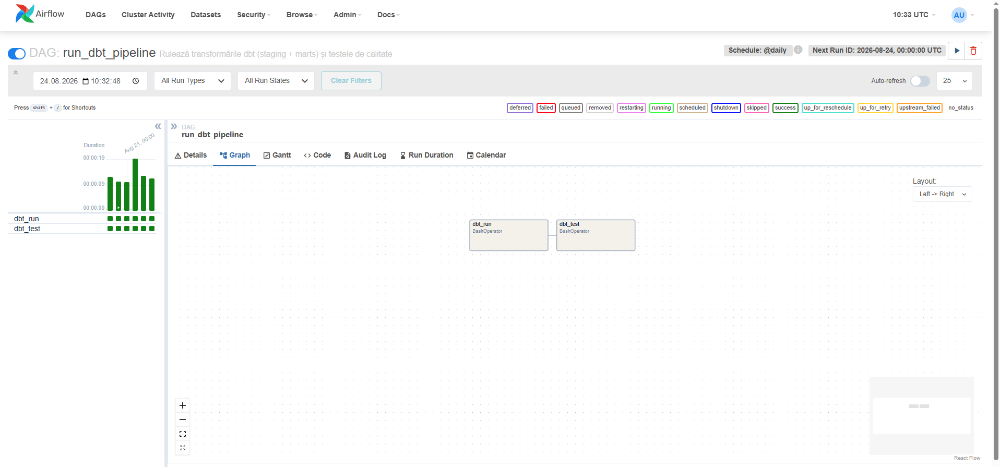
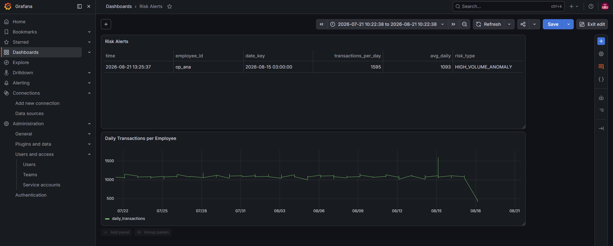

# riskledger

A data engineering pipeline built around a synthetic bank: transaction
volume at a scale that actually stresses the database, an Airflow
scheduler that runs on its own instead of being triggered by hand, a dbt
layer that turns raw operational tables into something a compliance
analyst could actually query, a statistical rule that flags unusual
activity automatically, and a Grafana dashboard that surfaces it.



## Status: complete

All five layers are built and wired together:

- **Data generation** — 10k accounts, 2M transactions, partitioned by year.
- **Orchestration (Airflow)** — two DAGs: one that checks data freshness,
  one that runs the dbt pipeline (`dbt run` → `dbt test`) on a schedule.
- **Transformation (dbt)** — staging models plus a star schema
  (`fact_transactions`, `dim_account`, `dim_employee`, `dim_date`), with
  9 passing data tests (uniqueness, not-null, referential integrity).
- **Anomaly detection** — a 3-sigma rule on daily transaction volume per
  employee, materialized as `fact_risk_flags`.
- **Dashboards & access** — a Grafana dashboard on top of the mart, plus
  a viewer-role account so not everyone who touches this has edit rights.

## Why it's structured this way

The raw `transactions` table is fine for an application writing one row
at a time, but it's the wrong shape for the questions a risk team
actually asks — "how many transactions did this employee process this
month," "what's the daily volume trend." Answering those directly
against `transactions` means rewriting the same joins and date logic
every time. dbt exists here to do that reshaping once: `stg_transactions`
and `stg_accounts` are thin pass-throughs over the raw tables, and
`fact_transactions` / `dim_account` / `dim_employee` / `dim_date` are the
star-schema layer built on top of them.

Airflow's first job here was narrow on purpose — a single DAG
(`check_data_freshness`) that just confirms the transaction count looks
sane, to prove the scheduler could talk to Postgres across the Docker
network before anything depended on it. The second DAG,
`run_dbt_pipeline`, is where Airflow actually earns its place: it runs
`dbt run` and then `dbt test` on a schedule, with `dbt_test` only firing
if `dbt_run` succeeds — the same dependency Airflow is built around,
just applied to a transformation job instead of a Python function.

## The anomaly rule

`fact_risk_flags` computes, per employee, the average and standard
deviation of daily transaction count, then flags any day where that
count is more than three standard deviations above the mean — the
standard 3-sigma threshold, which on a roughly normal distribution
should only ever catch genuine outliers, not a slightly busier Tuesday.

On the generated data (uniform random, no real anomalies) this correctly
flags nothing. To confirm the rule actually works rather than just
compiling, I inserted 500 extra transactions for a single employee on a
single day and re-ran the model — it caught it immediately:



## Two things that went wrong and why they're worth mentioning

**Airflow's webserver and scheduler need the same secret key.** Each
container generates its own random one by default, which means the
webserver can start, the scheduler can start, both look healthy in
`docker ps` — and then clicking into a task's log in the UI throws a 403
because the two components can't authenticate to each other. Nothing in
the scheduler logs pointed at this; the fix was setting
`AIRFLOW__WEBSERVER__SECRET_KEY` to the same literal string across all
three Airflow services in the compose file.

**dbt isn't in the base Airflow image.** The official `apache/airflow`
image doesn't ship dbt, and `pip install` inside a running container
fails with a permissions error because Airflow runs as a non-root user.
The actual fix was a small custom image (`Dockerfile.airflow`) that
installs `dbt-postgres` as the `airflow` user at build time, referenced
from `docker-compose.yml` with `build:` instead of `image:` on all three
Airflow services.

## What it looks like running

`run_dbt_pipeline` in Airflow — `dbt_run` succeeding, `dbt_test` only
starting once it does:



The same risk flag, in Grafana, next to the daily volume graph that
shows exactly why it fired:



## Running it

```
docker compose up -d
```

Builds a custom Airflow image (dbt included) and brings up Postgres,
Airflow (init/webserver/scheduler), and Grafana. Ports: 5435 (Postgres),
8090 (Airflow), 3002 (Grafana).

```
python -m venv venv
venv\Scripts\activate
pip install psycopg2-binary faker dbt-postgres
python scripts/generate_transactions.py
```

Generates the accounts and partitioned transactions table. Takes a
couple of minutes for 2M rows.

```
cd dbt_project
dbt run
dbt test
```

Builds every model and runs the 9 data tests. Or let Airflow do it:
`run_dbt_pipeline` in the UI runs the same two commands on a schedule.

Airflow UI: `http://127.0.0.1:8090`, admin/admin (set in compose).
Grafana: `http://localhost:3002`, admin/admin on first login (you'll be
asked to change it).

## A query the star schema was built for

```sql
SELECT e.employee_name, count(*) AS total
FROM fact_transactions f
JOIN dim_employee e ON f.employee_id = e.employee_id
GROUP BY e.employee_name
ORDER BY total DESC;
```

Against raw `transactions` this needs a `GROUP BY` on a text column with
no index backing it. Against the mart it's instant.

## Layout

```
riskledger/
├── docker-compose.yml
├── Dockerfile.airflow        # apache/airflow + dbt-postgres
├── dbt_profiles/
│   └── profiles.yml          # container-side dbt connection (host: postgres)
├── docs/                      # diagrams and screenshots referenced above
├── scripts/
│   └── generate_transactions.py
├── airflow/dags/
│   ├── check_data_freshness.py
│   └── run_dbt_pipeline.py   # dbt run -> dbt test, scheduled
└── dbt_project/
    └── models/
        ├── staging/           # stg_transactions, stg_accounts
        └── marts/             # dim_account, dim_date, dim_employee,
                                # fact_transactions, fact_risk_flags
```

## License

MIT
